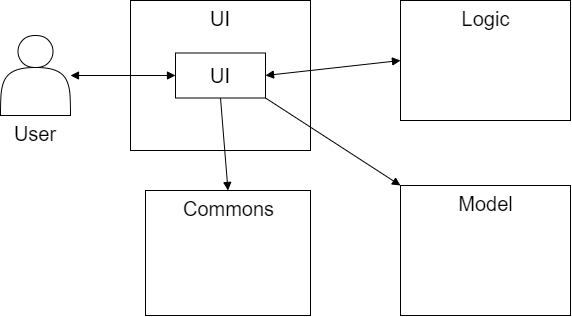
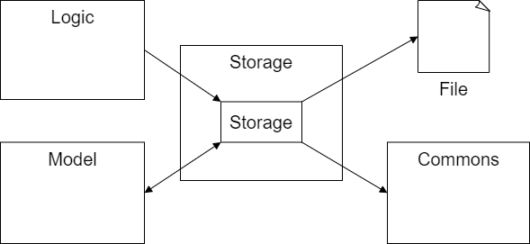

# Developer Guide - Diet Manager

## Content
1. [Design](#design)
    1. [Architecture](#architecture)
    2. [UI component](#ui-component)
    3. [Storage component](#storage-component)
    4. [Logic component](#logic-component)
    5. [Model component](#model-component)
    6. [Commons component](#commons-component)
2. [Implementation](#implementation)
    1. [Record Meal Feature](#1-record-meal-feature)
        1. [Proposed implementation](#11-proposed-implementation)
        2. [Step1. Generate command](#step1-generate-command)
        3. [Step2. Execute and Save Result](#step2-execute-and-save-result)
        4. [Design Considerations](#12-design-considerations)
        5. [Aspect: How RecordMealCommand executes and save results](#aspect-how-recordmealcommand-executes-and-save-results)
        6. [Aspect: Data structure to support the command](#aspect-data-structure-to-support-the-command)
3. [Product Scope](#product-scope)
    1. [Target user profile](#target-user-profile)
    2. [Value proposition](#value-proposition)
4. [User Stories](#user-stories)
5. [Non-Functional Requirements](#non-functional-requirements)
6. [Glossary](#glossary)
7. [Instructions for Manual Testing](#instructions-for-manual-testing)

## Design

### Architecture

The Architecture Diagram given above explains the high-level design of the Diet Manager Application.

The components involved are given below:

* `UI`: The Component responsible for reading user input and displaying command results.

* `Storage`: The Component responsible for reading, writing and saving of external data files.

* `Logic`: The Component responsible for managing the logic flow of the application and executing commands.

* `Model`: The Component responsible for storing information required by the application in-memory.

* `Commons`: A collection of classes used by multiple other components.

### UI component

The `UI` component is responsible for:
* Receiving all command line inputs from the user
* Displaying all system outputs to the user

The UI consists of the following classes: 
* `UI` - Reads user input and displays system output

The `UI` component
1. Reads user input and passes it to `Logic` for parsing and execution of the command.
2. Receives command results from `Logic` and listens 
for changes in `Model` to display updated information to the user.
3. Draws on `Commons` to obtain the relevant stored messages to be displayed to the user.

### Storage component

The `Storage` component is responsible for:
* Reading and loading data files to update the information in local memory during program start up.
* Writing and saving all data into the relevant data files.

The Storage consists of the following classes: 
* `Storage` - Stores all user profile information in respective data files

The `Storage` component
1. Reads data files (if present) using `Logic` and updates `Model` with the relevant information during start up.
2. Receives instructions from `logic` to save and write in-memory information from
`Model` into the relevant data files.

### Logic component

The `Logic` component is responsible for:
* Establishing the logic flow.
* Deciding how functional components interact with each other.

The Logic consists of the following classes:
* `AppManager` - Arranges the main workflow of the program.
* `Result` - Stores the command result in-memory.
* `CommandParser` - Parses the user input and generates a specific command.
* `"ABC"Parser` - A collection of parser classes which parses a specific input to generate a specific value.
* `Command` - An abstract class which other command classes inherits from.
* `"ABC"Command` - A collection of command classes inherited from `Command` which perform specific functions.

The `Logic` component
1. Receives the user input and parses it to generate a specific command.
2. Executes the command to generate a specific result.
3. Passes results to `UI` to display system output to the user.
4. Updates `Storage` to save any changes made to in-memory information if any to the respective data files.

### Model component

The `Model` component is responsible for:
* Storing all relevant information in-memory for the application to access.

The Model consists of the following classes: 
* `Profile` - Stores the personal information of a person including the name, age, gender, height, weight, weight goal, list of food consumed and list of weight changes
* `DailyFoodRecord` - Keeps a record of the food consumed in a day, comprising morning, afternoon and night
* `Food` - A food object which contains the relevant food information
* `FoodNutritionRecord` - Provides a data bank of food items with the food name and calories value
* `RecipeManager` - Generates and stores recipes depending on user information

The `Model` component
1. Receives instructions from `Logic` to update in-memory information.
2. Is not dependent on any of the other components.
3. Contains all the classes that are responsible for database and records of food and user

### Commons component

The `Commons` component is responsible for:
* Consisting of multiple useful classes which are utilised by other components in the application.

The Commons consists of the following classes: 
* `LogsCentre` - Tracks system through log records and saves them into a log file
* `MessageBank` - Consists of multiple standard system output messages for UI to print
* `Weekday` - Enumeration class for classifying all 7 possible days in a week
* `"ABC"Exception` - A collection of exceptions to aid in running of the application

## Implementation

{Describe the design and implementation of the product. Use UML diagrams and short code snippets where applicable.}
### 1. Record Meal Feature
#### 1.1 Proposed implementation
The record feature is facilitated by `RecordMealCommand`. It extends `Command` and overrides `execute()` and `saveResults()`

Given below is an example usage scenario and how the record mechanism behaves at each step.

Step 1.  The `ui` object gets user input and sends it to the `parser`. The `parser` then parses the original input into a standard `command`
and returns it. The command type is decided by the `commandPrompt`. The `RecordMealCommand` has `record-meal` as its commandPrompt. 
During the process a new`RecordMealCommand` object will be generated and returned to the `Logic` component.

### Step1. Generate command

Step 2.  The `Logic` composition calls the `execute()` method of the `RecordMealCommand` object. 

During the process of execution, the command object will generate a `ArrayList<Food> foodList`, which maintains all `Food` items listed in the user input. 
If a certain kind of `Food` can be found in the database of `FoodNuritionInfo`, then this food item will be fetched from the database. 
Else a new `Food` object will be generated simply with `foodName` without all the nutrition info.

During execution, the command object will try to get a `record` object of the class `DailyFoodRecord`. The date of record is specified by the user. 
If no record of that day is found in profile, it will automatically generate a new record of the day. Then with `foodList` and `record`, can call 
the method `record.recordMeals()`.

### Step2. Execute and Save Result

#### 1.2 Design Considerations
#### Aspect: How `RecordMealCommand` executes and save results
* Alternative 1 (current choice): Directly operate on the `Profile` object, more specifically, the `DailyFoodRecord` attribute in `Profile` object.
And save execution `results` in the `RecordMealCommand` object.
    * Pros: Logic is clear and easy to implement.
    * Cons: `Command` object has full access to `Profile` object, which is not safe. 
* Alternative 2: `RecordMealCommand` can only operate on `DailyFoodRecord` of the `Profile`.
    * Pros: Reduce dependency and potential risks. 
    * Cons: Different types of `Command` need different declarations/interface for `command.execute()` method. 

#### Aspect: Data structure to support the command
* Alternative 1 (current choice): Use a list to store daily food record for a profile.
    * Pros: Easy to implement and understand
    * Cons: The list is maintained by a `Profile` object. Can lead to more duties for a `Profile` object.
* Alternative 2: Use a `FoodHistoryManager` to keep record of daily meals.
    * Pros: More OOP.
    * Cons: Makes the execution procedure more complex.
    
## Product Scope
### Target user profile

Students that :
1. are too busy with schoolwork to carefully monitor their eating habits
2. are concerned about their health
3. likes to keep track of their meals/weight habit digitally
3. want to keep track of their weight

### Value proposition

Diet Manager aims to achieve the following:
1. Streamline the diet recording process 
2. Allow users to track food calories intake and monitor their eating habits
3. Enable users to monitor weight changes across time to work towards their ideal weight goal
4. Provide personalised information and recommendations for the user
5. Monitor and track user's weight changes to achieve weight goal
6. Check their BMI as well as the BMI table regardless of user

## User Stories

|Version| As a ... | I want to ... | So that I ...|
|--------|----------|---------------|------------------|
|v1.0| student|set a profile with personal information|receive personalised information regarding my diet|
|v1.0| student|record my calories intake|can keep track of my total calorie intake for the week effectively|
|v1.0| student|record my food intake|see what I ate today|
|v1.0| student|see my diet history|can track my diet and maintain a balanced and healthy diet lifestyle|
|v1.0| student|set a weight-goal|received feedback on progress regarding my weight goal|
|v1.1| student|record my weight changes|can see if i am doing well towards my expectation|
|v1.1| student|check nutritional values of certain foods|can check how much calories i am consuming|
|v1.1| student|check if I am keeping to my recommended caloric intake|do not over or under eat and maintain my diet|
|v1.1| student|add food items to the database|do not have to constantly check food nutritional value for common foods|
|v1.2| student|save my diet history|have a record of my daily food intake|
|v1.2| student|import my diet history|have access to previous records and be able to progress from there|
|v1.2| student|export my diet history|can view my previous records on other devices and never ever lose my progress|
|v1.2| student|receive workout advice based on my excess calorie intake for the day|can maintain my calories for the day|
|v2.0| student|generate a recommended food plan|know what to eat to meet recommended caloric intake|

## Non-Functional Requirements

Device Environment:
* Must have Java 11 or higher installed in OS
* 32-bit or 64-bit environment
* Command Line Interface or Terminal for Mac

Performance:
* Function offline, without the need for internet access
* Quick to launch and use
* No noticeable lag or delay in performance when running
* Intuitive and seamless for new users.
* Ability to export the data into a txt file to load on another OS

Reliability:
* Data files should be updated constantly and accurately, with no data loss
* Data records should be retrievable and readable
* Text inputs should produce similar results if utilised multiple times.
* Program should run without and forced-close error due to bugs

## Glossary

* *glossary item* - Definition

## Instructions for Manual Testing

{Give instructions on how to do a manual product testing e.g., how to load sample data to be used for testing}

Click [here](README.md) to go back to the main page.