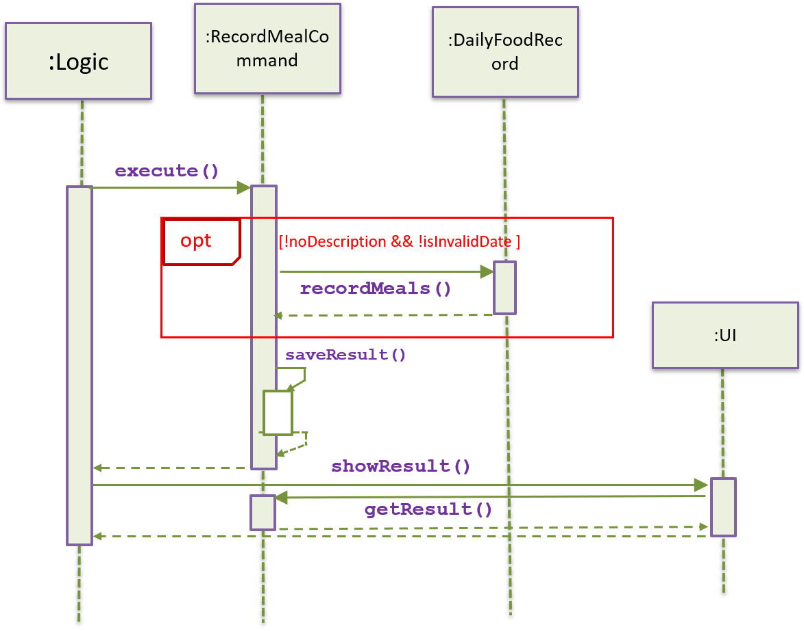

# Yan Chenghao (DDzuikeai) - Project Portfolio Page

---

## Content
1. [Overview](#overview)
2. [Summary of Contributions](#summary-of-contributions)
3. [Contributions to the User Guide](#contributions-to-the-user-guide)
4. [Contributions to the Developer Guide](#contributions-to-the-developer-guide)

---

## Overview
Diet Manager is an personal text-based chat-bot application used for managing an individual's diet.

Diet Manager is capable of tracking daily food intake and providing recommendations depending on a user's specified
health data.

---

## Summary of Contributions

### Code Contributed

**__Diet Manager__**: 
Link to code on tP Code Dashboard 
[**__here__**](https://nus-cs2113-ay1920s2.github.io/tp-dashboard/#breakdown=true&search=ddzuikeai).

### Enhancements implemented
#### Implement the `record-meal` and `check-meal` feature
* What it does: It allows user to record and check their meals.
* Justification: These two features improve the utility of the app since now user can use it to track
their daily meals.
* Highlights: The `record-meal` feature allows user to record as many food types as they want in a meal, and give
them the freedom to provide calories info together with foods or not. If the food can be found in database, then the 
app can automatically calculate calories intake for the user. If not in database, the user can provide calories info
so the app still can trace calories intake.

#### Implement the `addf` and `delf` feature
* What it does: It allows user to add foods and delete foods from our database.
* Justification: These features provide the user the way to customize their personal product. Because
they can change the database easily based on personal tastes and eating habits. It improve the utility
and convenience of the app.
* Highlights: These two features work also influence the `recommend` feature, because the app will customize
the recipe based on foods in database.

#### Implement the `recommend` feature
* What it does: It allows user to get recommended recipe based on their physical conditions and personal needs.
* Justification: This feature eliminates user's trouble to plan for each meal. They can easily get combinations
of food that can satisfy their calories intake needs.
* Highlights: The command is flexible, can adjust the recipe from two aspects. One is maximum food types in each
meal, the other is one's activity level(low/moderate/high) which indicates different levels of calories needs.

#### Other enhancements
* Implement the `clear-records` feature to enable user clear all their records.
* Implement the `calculate` feature which enables user to calculate their calories intake on a day or during a time period.
* Add DailyFoodRecord class and related codes to support all kinds of operations related to food record.

### Contributions to UG

* Which sections did you contribute to the UG?
Documented the details of following features (feature 1-12 in the UG):
    * Set user profile
    * View user profile
    * Record meals
    * Check meals
    * Clear food records
    * Check required calories
    * Calculate calories
    * List food database
    * Add food into database
    * Delete food from database
    * Get a recommended recipe
    * View recipe

### Contributions to the DG: 

* Which sections did you contribute to the DG? 
    * Help in building framework.
    * Documented the implementation of Record Meal Feature.
    
* Which UML diagrams did you add/updated?
    * The sequence diagrams that explain the workflow of record meal feature.
    
    Generate Command:
    
    
    
    Execute and Save Result:
    

### Contributions to team-based tasks 

Help review teammates' PR and provide suggestions.
